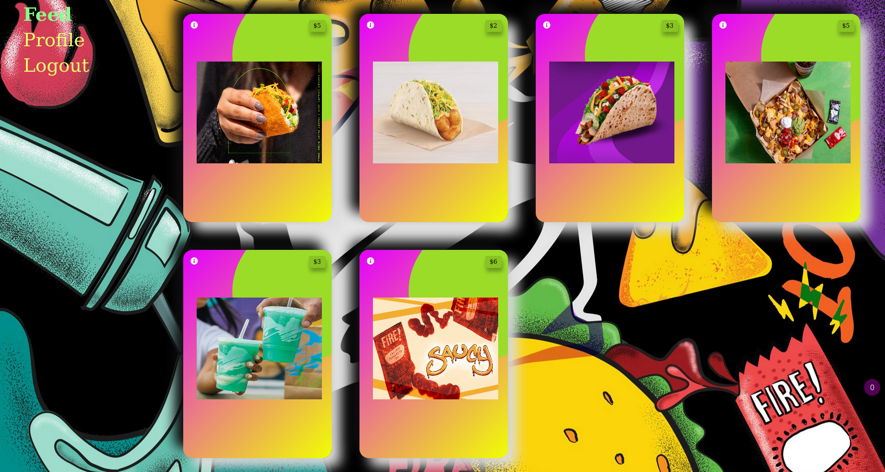
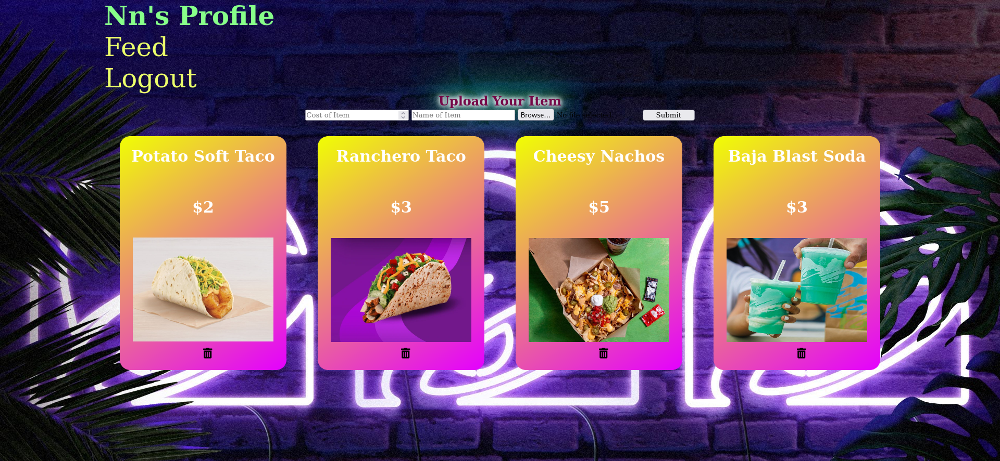

<h1 align="center">TacoBell Rating App</h1>

This is a full stack app built around my absolute love for TacoBell. Simply sign in or go straight into the Sign Up page. Once you are logged in, you are sent directly into
the Feed. This is a feed of every single post by every single user. You can click on a post and comment on each TacoBell item. In the Profile page, you can add the item of 
your choice along with the cost. Only you will be able to delete the items that you have personally uploaded into the feed. 

## Links

- [Repo](<https://github.com/naderhassan001/tacobell-rating-app> "<project-name> Repo")

- [Live](<https://tacobellratingapp.herokuapp.com/> "Live View")

## Screenshots

## Available Commands

In the project directory, you can run:

### `npm start" : "react-scripts start"`,

The app is built using `create-react-app` so this command Runs the app in Development mode. Open [http://localhost:3000](http://localhost:3000) to view it in the browser. You also need to run the server file as well to completely run the app. The page will reload if you make edits.
You will also see any lint errors in the console.

### `"npm run build": "react-scripts build"`,

Builds the app for production to the `build` folder. It correctly bundles React in production mode and optimizes the build for the best performance. The build is minified and the filenames include the hashes. Your app will be ready to deploy!

### `"npm run test": "react-scripts test"`,

Launches the test runner in the interactive watch mode.

### `"npm run dev": "concurrently "nodemon server" "npm run start"`,

For running the server and app together I am using concurrently this helps a lot in the MERN application as it runs both the server (client and server) concurrently. So you can work on them both together.

### `"serve": "node server"`

For running the server file on you can use this command.

### `npm run serve`

## Built With

- JavaScript
- Node
- NPM
- Webpack
- HTML
- CSS
- Bootstrap
- MongoDB
- Express

## Future Updates

- [ ] Google OAuth login will be added shortly. 

## Author

**Nader Hassan*

- [Profile](https://github.com/naderhassan001 "Nader Hassan")
- [Email](mailto:nader.hassan001@gmail.com "Hi!")

## 🤝 Support

Contributions, issues, and feature requests are welcome!

Give a ⭐️ if you like this project!
